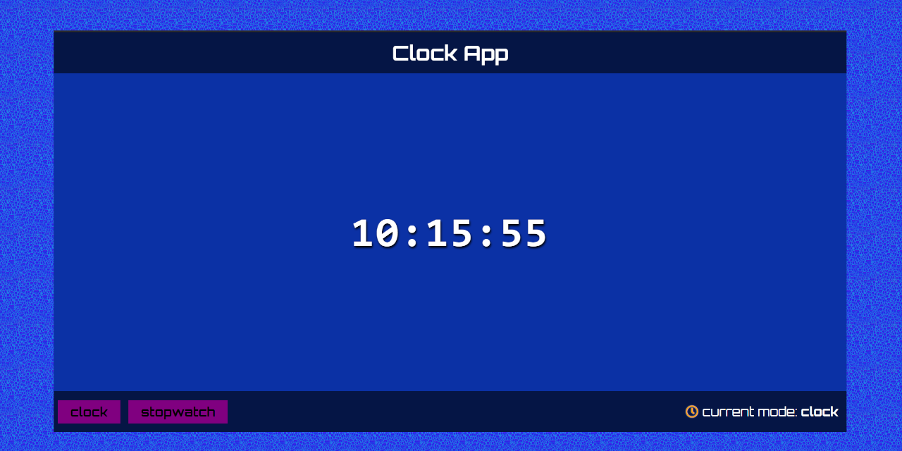
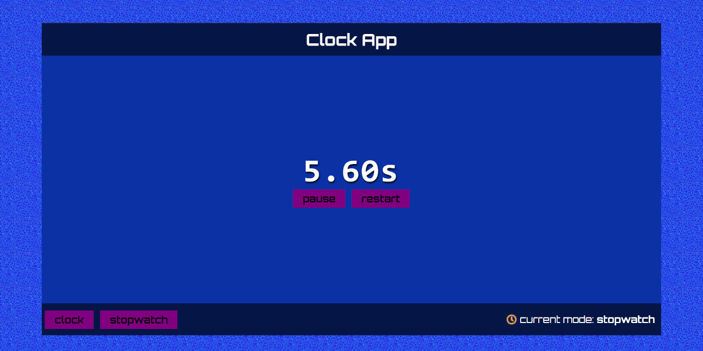

# Clock App
> Available on [GitHub Pages](krylak123.github.io/clock-app/)

## General info
The purpose of the project is expand a programming knowledge in JavaScript.

## Screenshots

## Technologies
* HTML
* SCSS
* JavaScript

## Features
* clock function
* stopwatch function
* showing the current mode

## To-do list:
* adding timer function
* adding the option to change the clock from digital to analog

## Status
Project is _in progress_